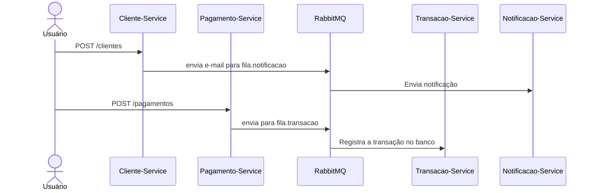

# ⚙️ Microsserviços - Cadastro, Pagamento e Notificação

[](https://www.oracle.com/java/)
[](https://spring.io/projects/spring-boot)
[](https://www.rabbitmq.com/)
[](https://www.docker.com/)

---

## 📌 Sobre o Projeto

Este projeto simula um ecossistema de **microsserviços com Java + Spring Boot** focado em **cadastro de clientes**, **pagamentos** e **notificações por mensageria**, utilizando **RabbitMQ** para comunicação assíncrona e **MySQL** para persistência de dados. Os serviços são desacoplados, escaláveis e cada um tem uma responsabilidade única.

---

## 🧩 Serviços Envolvidos

| Serviço               | Função                                                                 |
|----------------------|------------------------------------------------------------------------|
| `cliente-service`     | API REST para cadastro de clientes e envio de mensagem para notificação |
| `notificacao-service` | Consome mensagens e simula envio de e-mails no console                 |
| `pagamento-service`   | Recebe requisições de pagamento e envia transações para outro serviço |
| `transacao-service`   | Registra todas as transações financeiras no banco                     |

---

## 🔄 Fluxo de Negócio



---

## 🔧 Funcionalidades

-  Cadastro de cliente via API REST
-  Registro de pagamentos com valor e e-mail
-  Envio e consumo de mensagens com RabbitMQ
-  Registro de transações no serviço apropriado
-  Deploy com Docker Compose
-  Comunicação assíncrona desacoplada via filas
-  Separação clara de responsabilidades
-  Banco de dados MySQL para persistência realista

---

## 🧱 Arquitetura Utilizada

- **Microsserviços independentes**
- Comunicação por **RabbitMQ**
- Persistência com **JPA + MySQL**
- Escopo de **mensageria orientada a eventos**
- Estrutura modular e escalável
- Dockerizado (serviços sobem com `docker-compose`)

---

## 📁 Estrutura de Pastas

```
microsservicos-demo/
├── cliente-service/
│   ├── controller/
│   ├── model/
│   ├── repository/
│   └── messaging/
│
├── notificacao-service/
│   ├── consumer/
│   └── config/
│
├── pagamento-service/
│   ├── controller/
│   ├── model/
│   ├── messaging/
│   └── repository/
│
├── transacao-service/
│   ├── messaging/
│   ├── model/
│   └── repository/
│
├── docker-compose.yml
└── README.md
```

---

## 🚀 Como Executar Localmente

### Pré-requisitos

- Java 21+
- [Docker](https://www.docker.com/)
- [Docker Compose](https://docs.docker.com/compose/)

### Passos para subir o sistema

```bash
# 1. Clone o repositório
git clone https://github.com/seuusuario/microsservicos-demo.git
cd microsservicos-demo

# 2. Suba os serviços
docker-compose up --build
```

---

## 📬 Testando os Endpoints

### ✅ Cadastro de Cliente

```http
POST http://localhost:8080/clientes
Content-Type: application/json

{
  "nome": "Mayara",
  "email": "mayara@email.com"
}
```

### ✅ Enviar Pagamento

```http
POST http://localhost:8082/pagamentos
Content-Type: application/json

{
  "email": "mayara@email.com",
  "valor": 150.00
}
```

---

## 🛠️ Tecnologias Utilizadas

- **Java 21**
- **Spring Boot 3.x**
- **Spring Web / JPA**
- **RabbitMQ (AMQP)**
- **MySQL (pode ser adaptado para PostgreSQL)**
- **Docker e Docker Compose**

---

## 💡 Possíveis Expansões Futuras

| Ideia                          | Descrição |
|-------------------------------|-----------|
|  Autenticação JWT           | Segurança nos serviços REST |
|  Dashboard de métricas      | Spring Actuator + Prometheus + Grafana |
|  Testes com Testcontainers  | Testes de integração reais com filas e banco |
|  Retry e Dead Letter Queue  | Reprocessar transações com erro |
|  Histórico de transações    | Consultar via API as transações salvas |
|  Detecção de fraude         | Análise de transações suspeitas |
|  Email real                 | Integração com serviço SMTP |
|  Integração com sistemas externos de BI | Geração de relatórios ou dashboards |

---

## 👩‍💻 Autora

**Mayara Martinello Bastos**  
🌐 [linkedin.com/in/mayara-martinello-bastos](https://www.linkedin.com/in/mayara-martinello-bastos)  
📫 maybastos2021@gmail.com